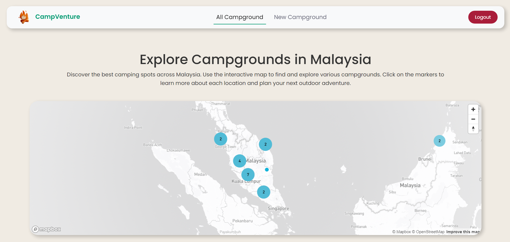
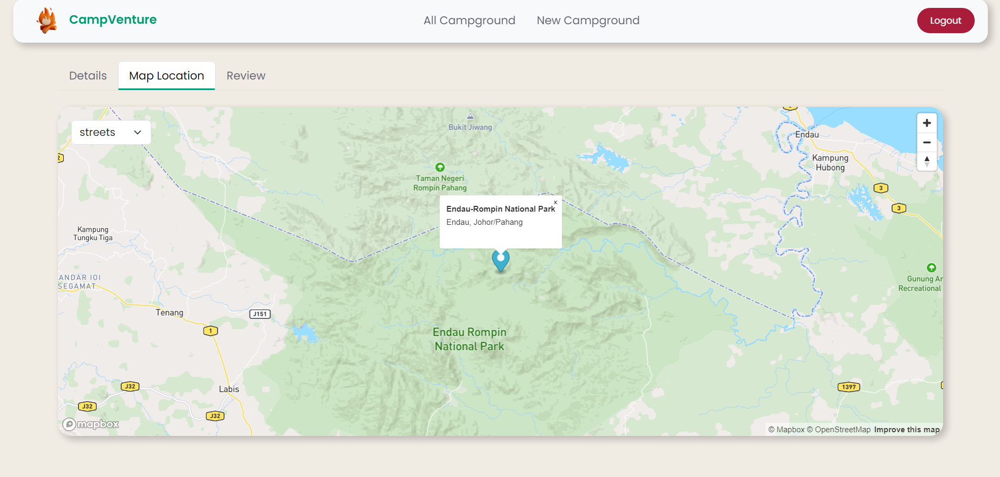
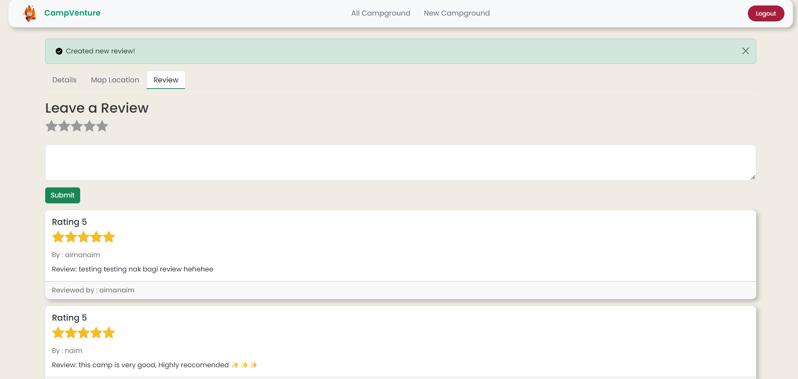
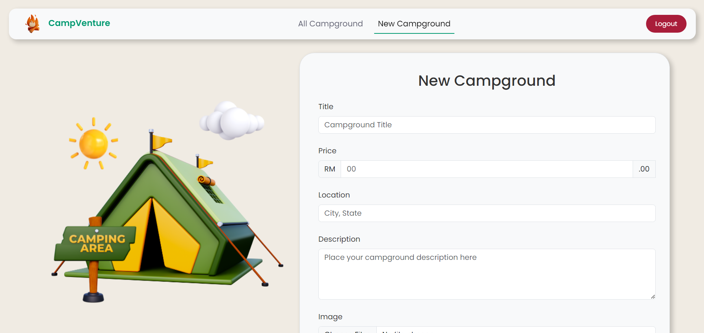

# CampVenture 🏕️

CampVenture is a full-stack web application that allows users to discover, create, and review campgrounds. This project is inspired by Colt Steele's "The Web Developer Bootcamp" course on Udemy that takes me 72 hours in total to complete the entire bootcamp. The estimation time for me to learn and complete this projects is around 3-4 weeks considering the details explanation from Colt Steele that talks deeply about Middleware , the MVC architecture for this project, middleware and the integration of the MapBox into this project websites.

## Tech Stack

- **Frontend:**
  - HTML
  - CSS
  - JavaScript
  - EJS (Embedded JavaScript templates)
  - Bootstrap 5 (for responsive design)

- **Backend:**
  - Node.js
  - Express.js

- **Database:**
  - MongoDB
  - Mongoose (ODM for MongoDB)

## Deployment

Deployed on [Heroku](https://www.heroku.com/).

## Security Features

- **Authentication:**
  - Implemented Passport.js for user authentication

- **Data Validation and Sanitization:**
  - Used Joi for server-side validation and sanitization
  - Sanitized HTML inputs to prevent Cross-Site Scripting (XSS) attacks

- **Mongo Injection Prevention:**
  - Used Mongoose to prevent NoSQL injection attacks

- **Additional Security Measures:**
  - Implemented helmet middleware for setting various HTTP headers to secure the application
 
<table>
  <tr>
    <td>
      
    </td>
    <td>
      
    </td>
  </tr>
</table>

## Map Integration

- Integrated **Mapbox** for displaying interactive maps and campground locations.

<table>
  <tr>
    <td>
      
    </td>
    <td>
      
    </td>
  </tr>
</table>

## Features

- **User Authentication:** Secure login and registration with password hashing.
- **Campground Management:** CRUD operations for campgrounds.
- **Reviews:** Users can leave reviews for campgrounds.
- **Image Uploads:** Users can add multiple images when creating a new campground. Images are stored in Cloudinary.

<table>
  <tr>
    <td>
      
    </td>
    <td>
      
    </td>
  </tr>
</table>

## Acknowledgements

- Colt Steele's "The Web Developer Bootcamp" course on Udemy for inspiration and guidance.
