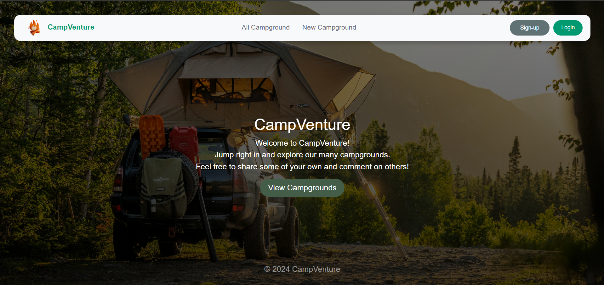

# CampVenture 🏕️



CampVenture is a modern single-page application that helps campers discover, create, and review outdoor getaways across Malaysia. The new architecture combines a React front-end (bootstrapped with Vite) with an Express/Node REST API backed by MongoDB, Passport.js authentication, and Mapbox for geospatial visualisations.

## Tech Stack

- **Frontend**: React 18, React Router, Axios, Vite, Bootstrap 5, Mapbox GL JS
- **Backend**: Node.js, Express.js, Passport.js, Mongoose, Joi, Cloudinary SDK
- **Database**: MongoDB Atlas or self-hosted MongoDB instance
- **Infrastructure & Tooling**: Helmet, express-session, Swagger UI, Mongo sanitize utilities

## Getting Started

1. **Install dependencies**
   ```bash
   npm install
   npm run client:install
   ```
2. **Configure environment variables** (create `config/config.env` for the server and `.env` inside `client/`):
   - **Server** (`config/config.env`)
     - `NODE_ENV` – `DEVELOPMENT` or `PRODUCTION`
     - `MONGODB_URL` – MongoDB connection string (used when `NODE_ENV!==DEVELOPMENT`)
     - `SECRET` – session secret
     - `MAPBOX_TOKEN` – Mapbox API token for server-side geocoding
     - `CLOUDINARY_CLOUD_NAME`, `CLOUDINARY_KEY`, `CLOUDINARY_SECRET` – Cloudinary credentials
     - `CLIENT_ORIGIN` – comma-separated list of allowed SPA origins (defaults to `http://localhost:5173`)
   - **Client** (`client/.env`)
     - `VITE_MAPBOX_TOKEN` – Mapbox token for the interactive maps in the SPA
     - `VITE_API_BASE_URL` *(optional)* – override `/api` if the API is hosted on a different origin
3. **Run the app in development**
   ```bash
   # Start the API (port 3000)
   npm run dev

   # In another terminal, start the React client (port 5173)
   npm run client:dev
   ```
4. **Build for production**
   ```bash
   npm run client:build
   npm run prod
   ```
   The Express server will automatically serve the contents of `client/dist`.

   > **Branding tip:** The React client ships with emoji-based placeholders. Add your own imagery under `client/public/` or
   > importable assets inside `client/src/` if you want custom logos and backgrounds.

## Available Scripts

| Command | Description |
| --- | --- |
| `npm run dev` | Start the Express API in development mode with Nodemon. |
| `npm run prod` | Run the API in production mode (expects built client assets). |
| `npm run client:dev` | Start the React development server (Vite). |
| `npm run client:build` | Generate a production build of the React client. |
| `npm run client:test` | Run the client test suite (Vitest). |
| `npm run client:install` | Install dependencies for the React client. |

## API Overview

The Express application now exposes JSON endpoints under the `/api` prefix:

- `POST /api/auth/register` – create an account and start a session
- `POST /api/auth/login` / `POST /api/auth/logout`
- `GET /api/auth/me` – fetch the currently authenticated user
- `GET /api/campgrounds` – list all campgrounds (with geometry data)
- `POST /api/campgrounds` – create a campground (multipart form for images)
- `GET /api/campgrounds/:id` – retrieve a campground with reviews
- `PUT /api/campgrounds/:id` – update campground details and images
- `DELETE /api/campgrounds/:id` – remove a campground
- `POST /api/campgrounds/:id/reviews` & `DELETE /api/campgrounds/:id/reviews/:reviewId`

Swagger documentation remains available at `/api-docs`.

## Features

- **React SPA** with client-side routing, responsive layouts, and Mapbox-powered visualisations
- **Secure authentication** via Passport.js sessions with cross-origin support for the SPA
- **Campground management** including rich image uploads (Cloudinary) and geocoded locations
- **Reviews system** with rating controls, user ownership checks, and live updates
- **Security hardening** using Helmet, express-session, input sanitisation, and validation through Joi

## Deployment Notes

1. Build the React client with `npm run client:build` before deploying the Express server.
2. Ensure `CLIENT_ORIGIN` and `VITE_MAPBOX_TOKEN` reflect the deployed domains.
3. When serving behind HTTPS in production, keep `NODE_ENV=PRODUCTION` so cookies are marked `Secure`/`SameSite=None`.

## Acknowledgements

- Inspired by Colt Steele's *The Web Developer Bootcamp* curriculum.
- Map tiles by [Mapbox](https://www.mapbox.com/). Images hosted on [Cloudinary](https://cloudinary.com/).
